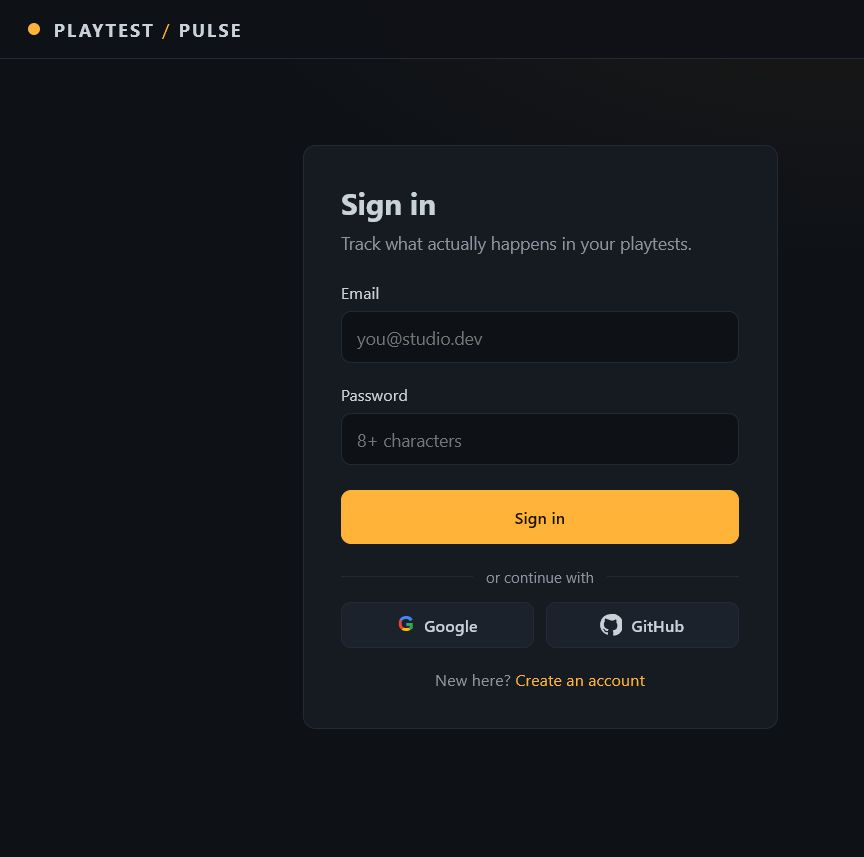
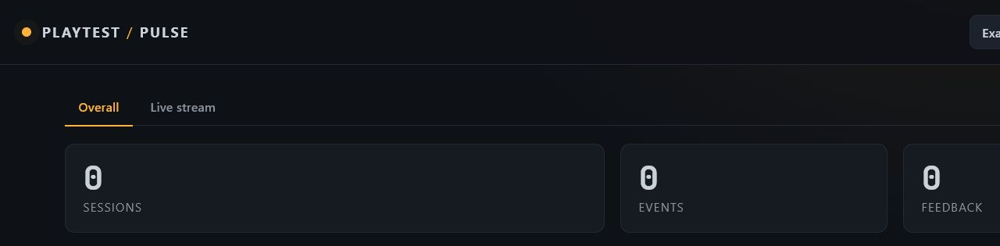

# Playtest Pulse

**Drop-in playtest telemetry & feedback analytics for game developers.**
A Luau SDK streams gameplay events and player feedback from a Roblox game to a
Node backend; a live dashboard shows what's happening, and an LLM turns raw
feedback into ranked, quoted themes.

**[Open the live demo](https://playtest-pulse.onrender.com)**

Playtest Pulse is built as a playtest debugging layer—not a replacement for
Roblox's aggregate analytics. It connects player behavior, feedback, and
session-level telemetry so a developer can answer: **what should we fix next?**

### Highlights

- Google and GitHub sign-in, plus email/password accounts
- Isolated workspaces with per-game API keys and JWT-protected dashboards
- Batched Roblox telemetry ingestion with retry behavior and rate limiting
- Live event stream, game management, feedback themes, and connection setup

| Sign in | Dashboard |
| --- | --- |
|  |  |

> Built to answer a question every solo game dev asks after a playtest:
> *"What actually happened in there, and what did people hate?"* — right now
> that data lives in a mess of Discord messages and gut feeling.

---

## Run it locally (about 60 seconds)

```bash
npm install
npm start
```

Open **http://localhost:3000**, create an account, and create a game to get an
API key.

Want a populated dashboard immediately? The app creates the demo workspace on
startup. Sign in with:

- **email:** `demo@playtestpulse.dev`
- **password:** `demopassword123`

You'll see 15 sessions of realistic dungeon-crawler telemetry and feedback.
Click **Summarize feedback** to cluster it into themes. If the local data file
is reset, the demo workspace is recreated automatically on the next start.

Reset everything with `npm run reset`.

---

## Architecture

```
 ┌────────────────┐   HTTP POST /ingest     ┌──────────────────────┐
 │  Roblox game   │  (x-api-key, batched)   │   Node / Express API │
 │  Telemetry SDK │ ─────────────────────►  │ auth · games · ingest│
 └────────────────┘                         │  stats · summarize   │
                                            └──────────┬───────────┘
 ┌────────────────┐   JWT (dashboard)                  │
 │  Dashboard SPA │ ◄──────────────────────────────────┤
 │  live polling  │                                    ▼
 └────────────────┘                            ┌──────────────┐
                                               │  JSON store  │
        ┌───────────────────────┐              └──────────────┘
        │  LLM feedback themes   │◄── on-demand, with local fallback
        └───────────────────────┘
```

**Two trust boundaries, on purpose:**

- **Dashboard** → developer accounts authenticated with bcrypt + JWT.
- **Ingestion** → per-game API key (`x-api-key`), rate-limited.

A leaked game key can never read another dev's dashboard; a stolen dashboard
token is not a valid SDK key.

## Data model (`db.js`)

`users` → `games` (one API key each) → `sessions` → `events` / `feedback`.

Decisions worth noting:

- **API key on `games`, not `users`** — revoke per-game without nuking the account.
- **`events.properties` is JSON** — SDK sends arbitrary event shapes with no
  migration; trade-off is weaker typing on deep queries.
- **`client_ts` + `server_ts`** — never trust the client clock; keep what the
  client *claims* and what the server *observed*.
- **`player_ref` is a salted hash** — no raw Roblox UserId is ever stored (no
  PII we don't need). Per-game salt prevents cross-game correlation.
- **Batch ingest is a transaction** — a game never persists half a batch.

## The SDK (`sdk/Telemetry.luau`)

Server-side Luau module. Batches events per player and flushes on an interval
via `HttpService`, retries on transient failure (buffer only clears on server
ACK), and auto-closes sessions on `PlayerRemoving` and `BindToClose`.

```lua
local Telemetry = require(ServerScriptService.Telemetry)
Telemetry.Configure({ endpoint = "https://your-app.example.com", apiKey = "pk_..." })
Telemetry.init()

Telemetry.StartSession(player)
Telemetry.Track(player, "level_started", { level = 3 })
Telemetry.SubmitFeedback(player, "the boss felt unfair")
```

See `sdk/ExampleUsage.server.luau` for realistic wiring.

## LLM feedback summarizer (`summarize.js`)

Set `ANTHROPIC_API_KEY` to get LLM-extracted themes (title, recurrence count,
severity, representative quote). With no key set, it falls back to a local
keyword-frequency pass so the feature always works — deliberate graceful
degradation.

## Tech

Node + Express · dependency-free JSON store behind a swappable repository interface (drop-in Postgres for prod) · bcrypt + JWT ·
express-rate-limit · vanilla JS dashboard (no build step) · Luau SDK.

## Roadmap

- WebSocket live stream (replace 3s polling)
- Cached `feedback_summaries` table to avoid re-summarizing unchanged batches
- Funnel + retention views (session → level_started → level_completed)
- In-game feedback prompt UI component shipped with the SDK
